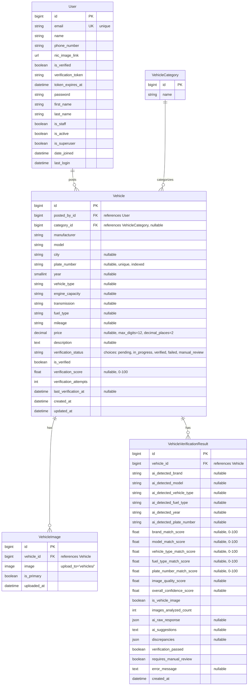

# Entity Relationship Diagram

This document contains the ER diagram for the Vehicle Ads Posting Automation Site backend database schema.

## ER Diagram (Mermaid)

## Model Relationships

### User Model
- **Extends**: Django's `AbstractUser`
- **Relationships**:
  - One-to-Many with `Vehicle` (a user can post multiple vehicles)
- **Key Fields**:
  - `email`: Unique identifier (USERNAME_FIELD)
  - `is_verified`: Email verification status
  - `verification_token`: Token for email verification
  - `token_expires_at`: Token expiration time

### VehicleCategory Model
- **Relationships**:
  - One-to-Many with `Vehicle` (a category can have multiple vehicles)
- **Key Fields**:
  - `name`: Category name

### Vehicle Model
- **Relationships**:
  - Many-to-One with `User` (posted_by)
  - Many-to-One with `VehicleCategory` (category, nullable)
  - One-to-Many with `VehicleImage` (has multiple images)
  - One-to-Many with `VehicleVerificationResult` (has multiple verification results)
- **Key Fields**:
  - `plate_number`: Unique identifier for vehicles (indexed)
  - `verification_status`: Current verification state
  - `verification_score`: AI confidence score (0-100)
  - `is_verified`: Verification status flag

### VehicleImage Model
- **Relationships**:
  - Many-to-One with `Vehicle` (belongs to a vehicle)
- **Key Fields**:
  - `is_primary`: Flag for primary image
  - `image`: Image file stored in 'vehicles/' directory

### VehicleVerificationResult Model
- **Relationships**:
  - Many-to-One with `Vehicle` (verification result for a vehicle)
- **Key Fields**:
  - AI-detected fields: `ai_detected_brand`, `ai_detected_model`, etc.
  - Match scores: Various score fields (0-100) for comparing AI detection with user input
  - `overall_confidence_score`: Overall AI confidence
  - `verification_passed`: Whether verification passed
  - `requires_manual_review`: Flag for manual review requirement

## Relationship Details

1. **User → Vehicle**: 
   - Relationship: One-to-Many
   - On Delete: CASCADE (if user is deleted, their vehicles are deleted)
   - Related Name: `vehicles`

2. **VehicleCategory → Vehicle**: 
   - Relationship: One-to-Many
   - On Delete: SET_NULL (if category is deleted, vehicle category is set to NULL)
   - Nullable: Yes

3. **Vehicle → VehicleImage**: 
   - Relationship: One-to-Many
   - On Delete: CASCADE (if vehicle is deleted, images are deleted)
   - Related Name: `images`

4. **Vehicle → VehicleVerificationResult**: 
   - Relationship: One-to-Many
   - On Delete: CASCADE (if vehicle is deleted, verification results are deleted)
   - Related Name: `verification_results`

## Notes

- The `User` model extends Django's `AbstractUser`, inheriting standard authentication fields
- `Vehicle.plate_number` is unique and indexed for fast lookups
- `VehicleVerificationResult` stores detailed AI verification data including match scores and discrepancies
- All models include `created_at` and/or `updated_at` timestamps for tracking
- The verification system supports multiple verification attempts per vehicle

